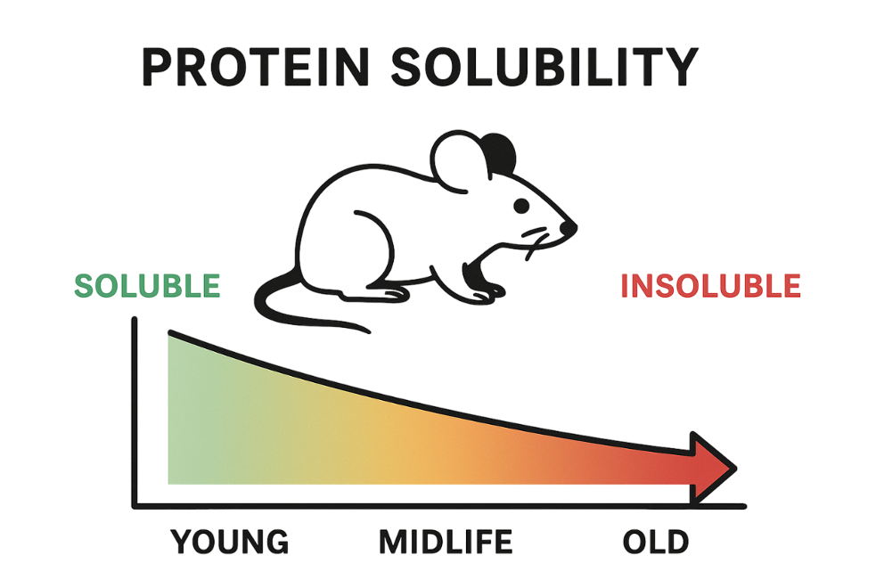
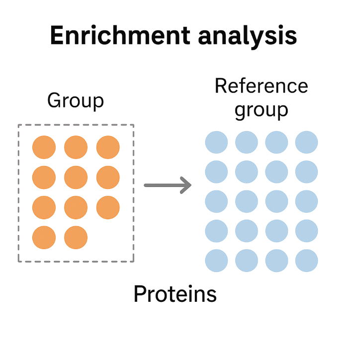

# Project Overview: Integrated Protein Enrichment & Aggregation Analysis App
## KIDS25-Team14

## Biological context & motivation

Aging leads to a progressive decline in proteostasis (protein homeostasis), which manifests as a **reduction in global protein solubility**across mammalian tissues. This decline is strongly linked to cumulative **oxidative damage and post-translational modifications**, which increase the propensity of proteins to misfold and aggregate.

These effects are especially pronounced in long-lived, non-dividing cells such as neurons, skeletal/cardiac muscle, and heart, where insoluble, aggregated proteins can persist and accumulate over a lifetime. The accumulation of insoluble protein is a well-documented feature of aging brains and neurodegenerative diseases and is likely important for muscle and cardiac aging as well.
Our project provides a unified toolkit for mapping, quantifying, and exploring these changes in proteomic datasets, enabling new insights into where and why insolubility and aggregation risks are greatest.

## Project details

* Team is provided with a complied list of proteins from aged mouse skeletal muscle that follow the trend of reduced solubility with age.
* It is still unknown what unifying features these proteins share; are there common functions, pathways, structural motifs, or aggregation propensities?
* Our plan:
    * Perform comprehensive enrichment analysis across multiple data modalities (GO, KEGG, sequence motifs, structure/aggregation)
    * Investigate both sequence and structural properties, including risk of aggregation, to reveal common threads
* Our solution:
    * Wrap all analyses in a single user-friendly interface, dramatically simplifying protein enrichment for experimentalists
    * Researchers can upload a list of proteins and instantly explore meaningful patterns and predictions without any coding requirement

## Methods

* **Established enrichment analysis** 
    * Gene ontology (GO) & KEGG pathway analysis: Classical enrichment test to identify over-represented molecular functions, biological processes, and pathways among insoluble proteins.
    * AggrescanDB (Aggrescan3D) integration: For each with either known structure or AlphaFold predicted structure, the Aggrescan3D neural network API predicts aggregation propensity which informs which proteins in the set are more likely to misfold/aggregate.

* **Structural motif searching** 
    * FoldDisco-based motif analysis was used to systematically identify both known and novel 3D structural motifs within protein subsets of interest.
    * Motif enrichment was assessed by comparing motif occurrence in the target subset against a reference (background) protein set, enabling discovery of structural features uniquely associated with protein insolubility or aggregation propensity.

* **User interface/data visualization**
    * All analyses are automated through R-Markdown and Jupyter notebooks, which orchestrate data processing, enrichment analysis, and initial visualization in a reproducible manner.
    * Results are delivered through an interactive Shiny web application, enabling researchers, regardless of computational background to intuitively explore protein enrichment, aggregation scores, pathway results, and structural motif insights via dynamic plots and searchable data tables.

## KIDS25-Team14 

* Kincaid Rowbotham
* Lei Li
* Saranya Canchi
* Madhan Kumar Tammineni
* Ankita T. Kandalkar 

